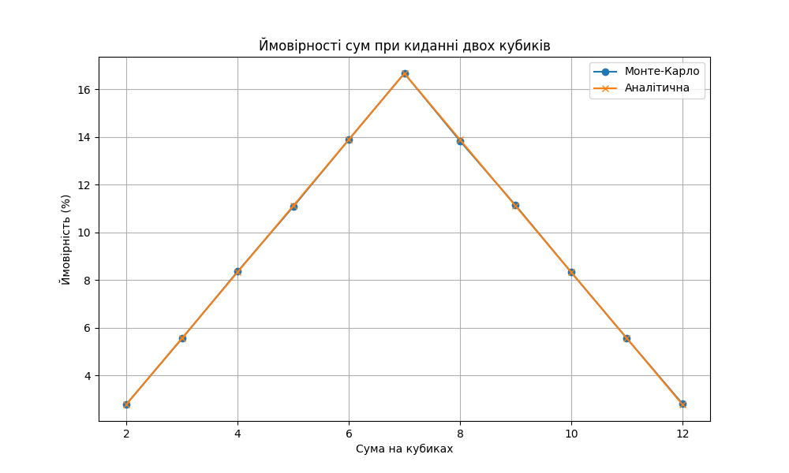

Результати, отримані в результаті моделювання методом Монте-Карло для кидання гральних кубиків, близькі до теоретичних ймовірностей. Це підтверджує точність методу Монте-Карло для оцінки ймовірностей випадкових процесів. Результати демонструють надійність і корисність методів імітаційного моделювання в імовірнісних обчисленнях.

|  Сума   |    Монте-Карло %  |  Аналітичнo  (%) |
|--------:|------------------:|------------------:|
|       2 |            2.7885 |              2.78 |
|       3 |            5.5479 |              5.56 |
|       4 |            8.3717 |              8.33 |
|       5 |           11.1112 |             11.11 |
|       6 |           13.881  |             13.89 |
|       7 |           16.6989 |             16.67 |
|       8 |           13.8484 |             13.89 |
|       9 |           11.1039 |             11.11 |
|      10 |            8.3226 |              8.33 |
|      11 |            5.5722 |              5.56 |
|      12 |            2.7537 |              2.78 |
